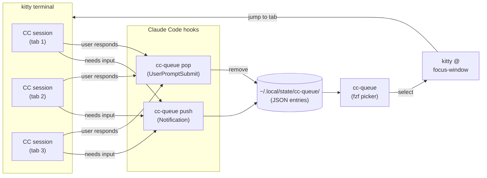

# cc-queue

An input queue for [Claude Code](https://docs.anthropic.com/en/docs/claude-code) sessions running across multiple [kitty](https://sw.kovidgoyal.net/kitty/) terminal tabs and windows.

When you run several Claude Code sessions in parallel, any one of them might need your input — a permission prompt, a question, or just waiting for your next instruction. `cc-queue` captures these events via Claude Code hooks and lets you quickly jump to the right tab with fzf.

## How it works



1. Claude Code fires a `Notification` hook when it needs input
2. The hook runs `cc-queue push`, which records the kitty window ID, working directory, and event type
3. You run `cc-queue` to see all pending sessions in fzf, pick one, and jump straight to it
4. When you provide input, the `UserPromptSubmit` hook runs `cc-queue pop` to clear the entry

## Requirements

- [kitty](https://sw.kovidgoyal.net/kitty/) with `allow_remote_control` and `listen_on` configured
- [fzf](https://github.com/junegunn/fzf)
- [Go](https://go.dev/) 1.25+ (build only)

## Install

```sh
go install github.com/duboisf/cc-queue@latest
```

Or build from source:

```sh
git clone https://github.com/duboisf/cc-queue.git
cd cc-queue
go build -o cc-queue .
cp cc-queue ~/.local/bin/  # or anywhere in PATH
```

Then install the Claude Code hooks:

```sh
# User-level (all projects)
cc-queue install --user

# Project-level only
cc-queue install --project

# With optional kitty keyboard shortcuts
cc-queue install --user --picker-shortcut 'kitty_mod+shift+q' --first-shortcut 'kitty_mod+shift+u'
```

This adds two hooks to your Claude Code settings and optionally configures kitty keyboard shortcuts:
- **Notification** (`permission_prompt|idle_prompt|elicitation_dialog`) → `cc-queue push`
- **UserPromptSubmit** → `cc-queue pop`

## Kitty config

The `install` command automatically creates a `cc-queue.conf` in your kitty config directory with remote control enabled. If you prefer to configure it manually, add this to your `kitty.conf`:

```conf
allow_remote_control  socket-only
listen_on             unix:/tmp/kitty-{kitty_pid}
```

## Usage

```sh
cc-queue              # fzf picker — select a session and jump to it
cc-queue first        # jump straight to the most recent entry
cc-queue list         # plain text list of pending items
cc-queue clear        # remove all entries
cc-queue clean        # remove stale entries (dead processes)
```

The fzf view shows age, event type, and working directory:

```
 2m  PERM  ~/git/gcp/gcp-infra
 5m  ASK   ~/git/cc-queue
 1m  IDLE  ~/git/gcp/gcp-auth
```

Event labels:
- **PERM** — Claude Code needs tool permission
- **ASK** — Claude Code is asking you a question
- **IDLE** — Claude Code finished its turn, waiting for input

## How entries are managed

- One entry per CC session (keyed by `session_id`), stored in `~/.local/state/cc-queue/`
- New events for the same session overwrite the previous entry
- Stale entries (dead PIDs) are pruned automatically on every `push`
- Entries are removed when you jump to them or when `UserPromptSubmit` fires

## License

MIT
